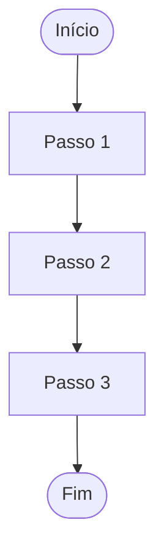
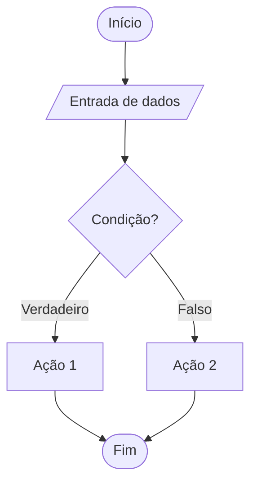
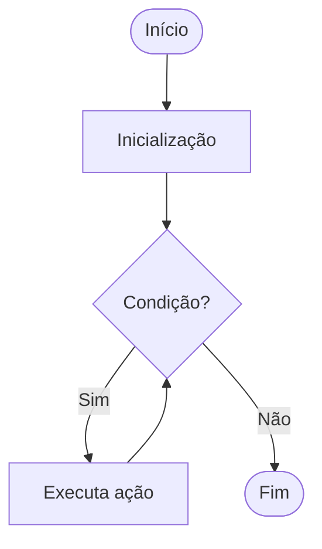

# 🧠 Guia Completo — Algoritmos e Lógica de Programação

---

## 📌 1. Fundamentos de Sistemas Computacionais

Um sistema computacional é formado por **hardware + software**, responsáveis pelo processamento de dados.

---

## 🖥️ Hardware básico

- **Barramento interno**  
  → Responsável pela comunicação entre os componentes  
  📌 Exemplo: leva dados do SSD → RAM → CPU  

- **Memória (RAM)**  
  → Armazenamento temporário e rápido  
  📌 Exemplo: programas abertos ficam na RAM  

- **Armazenamento (HD/SSD)**  
  → Guarda dados permanentemente  
  📌 Exemplo: arquivos, jogos, sistema operacional  

- **CPU (processador)**  
  → Executa instruções  
  📌 Exemplo: cálculos, execução de programas  

---

## 🔄 Ciclo de instrução

1. **Fetch (buscar)** → busca a instrução na memória  
2. **Decode (decodificar)** → interpreta a instrução  
3. **Execute (executar)** → realiza a operação  

📌 Exemplo:
- Buscar: "somar 2 + 2"  
- Decodificar: operação de soma  
- Executar: resultado = 4  

---

## 🔢 Representação numérica

- Sistema **binário (base 2)**  
- Usa apenas **0 e 1**

📌 Exemplo:
- Decimal: 5  
- Binário: 101  

💻 Código (Python):
    # decimal → binário
    n = 5
    print(bin(n))  # 0b101

    # binário → decimal
    print(int("101", 2))  # 5

---

## 🧠 Memória e endereçamento

- Cada dado possui um **endereço único**
- Funciona como “posição na memória”

📌 Exemplo:

| Endereço | Valor |
|----------|------|
| 1000     | 10   |
| 1001     | 20   |

💻 Código (simulação):
    memoria = {
        1000: 10,
        1001: 20
    }

    print(memoria[1000])  # 10

---

## ⚙️ Compiladores

- Traduzem código de alto nível → linguagem de máquina  

### Etapas:
1. Análise  
2. Tradução  
3. Geração de código  

💻 Código (C):
    #include <stdio.h>

    int main() {
        int a = 2;
        int b = 3;
        int soma = a + b;

        printf("%d", soma);
        return 0;
    }

➡️ Esse código é convertido em **binário executável**

---

## 🔁 Resumo geral

Entrada → Processamento → Saída

📌 Exemplo:
- Entrada: usuário digita algo  
- Processamento: CPU executa  
- Saída: resultado na tela  

---
## 📌 2. Conceitos de Algoritmos e Lógica

Um **algoritmo** é uma sequência finita de passos bem definidos para resolver um problema.

---

## 🧩 Características de um algoritmo

- **Finito** → sempre termina após um número limitado de passos  
- **Determinístico** → mesma entrada → mesma saída  
- **Sequencial** → passos executados em ordem lógica  
- **Não ambíguo** → instruções claras e objetivas  
- **Entrada e saída** → recebe dados e produz resultado  

---

## 🧠 Lógica de programação

- Organização do pensamento para resolver problemas  
- Base para qualquer linguagem de programação  
- Envolve:
  - análise do problema  
  - definição de passos  
  - validação da solução  

📌 Exemplo:
Problema → somar dois números  
Lógica → receber valores → somar → mostrar resultado  

---

## 🛠️ Métodos de construção de algoritmos

### 🔹 Pseudocódigo (linguagem informal estruturada)

Exemplo:
    INICIO
        leia A
        leia B
        SOMA ← A + B
        escreva SOMA
    FIM

---

### 🔹 Fluxograma (representação gráfica com Mermaid)

```mermaid
flowchart TD
    A([Início]) --> B[/Entrada: idade/]
    B --> C{idade >= 18?}
    C -->|Sim| D[Escreva "Maior de idade"]
    C -->|Não| E[Escreva "Menor de idade"]
    D --> F([Fim])
    E --> F
```

---

### 🔹 Sequencial


---

### 🔹 Condicional (if/else)


---

### 🔹 Repetição (loop)


---

## 📌 3. Tipos de Dados, Variáveis e Operadores

### 📦 Tipos de dados básicos

* Inteiro (int)  
* Real (float)  
* Caractere (char)  
* Lógico (boolean)  

---

### 🔤 Variáveis

* Espaços na memória para armazenar valores  
* Possuem **nome, tipo e valor**  

---

### ➕ Operadores

* **Aritméticos** → +, -, *, /  
* **Relacionais** → >, <, ==, !=  
* **Lógicos** → AND, OR, NOT  

---

### 📊 Representações gráficas

* Fluxogramas  
* Diagramas de blocos  

📚 **Dica de estudo:**  
Variável = espaço nomeado na memória

---

## 📌 4. Estruturas Fundamentais de Programas

As estruturas de controle determinam o fluxo de execução do algoritmo.

---

### 🔄 Sequencial

Execução linha por linha.

---

### 🔀 Condicional

Permite decisões.

SE idade >= 18 ENTAO  
&nbsp;&nbsp;adulto  
SENAO  
&nbsp;&nbsp;menor  
FIMSE  

---

### 🔁 Repetição

Executa várias vezes.

* FOR  
* WHILE  
* DO WHILE  

📚 **Dica de estudo:**  
Todo programa usa: sequência + decisão + repetição

---

## 📌 5. Sub-rotinas e Funções

São blocos de código reutilizáveis.

### 🔧 Funções

* Retornam valor  

### 🔁 Procedimentos

* Não retornam valor  

---

### 🎯 Vantagens

* Reutilização de código  
* Organização  
* Manutenção facilitada  

📚 **Dica de estudo:**  
Função = resolve um problema específico

---

## 📌 6. Estruturas de Dados: Vetores e Matrizes

Variáveis compostas homogêneas (mesmo tipo de dados).

---

### 📊 Vetores

* Lista de elementos do mesmo tipo  
* Acesso por índice  

vetor[0], vetor[1], vetor[2]

---

### 🧩 Matrizes

* Tabela (linhas e colunas)  

matriz[linha][coluna]

---

### 🎯 Aplicações

* Listas de dados  
* Tabelas  
* Processamento de informações  

📚 **Dica de estudo:**  
Vetor = 1 dimensão  
Matriz = 2 dimensões

---

## 📌 7. Boas Práticas, Legibilidade e Testes

### 🧹 Estilo de codificação

* Indentação correta  
* Nomes claros e significativos  
* Código organizado  

---

### 💬 Comentários

* Explicam o código  
* Facilitam manutenção  

---

### 🧪 Testes

* **Teste de mesa** → simulação manual  
* **Teste unitário** → valida partes do código  

📚 **Dica de estudo:**  
Código bom = legível + organizado + testado

---

## 📌 8. Controle de Versão e Gestão de Código

O controle de versão permite gerenciar alterações no código ao longo do tempo.

---

### 🧾 Conceitos principais

* Repositório (local e remoto)  
* Versionamento de código  
* Histórico de mudanças  

---

### 🔄 Operações básicas

* **Commit** → salvar alterações  
* **Push** → enviar para repositório remoto  
* **Pull** → atualizar código  
* **Checkout** → recuperar versões  
* **Check-in / Check-out** → controle de edição  

---

### 🎯 Objetivos

* Trabalho em equipe  
* Controle de alterações  
* Recuperação de versões  

📚 **Dica de estudo:**  
Git = controle do histórico do código

---

## 🎯 Síntese Final

* Sistemas computacionais executam instruções usando hardware e software  
* Algoritmos resolvem problemas de forma estruturada  
* Estruturas básicas controlam o fluxo do programa  
* Funções e estruturas de dados organizam o código  
* Boas práticas melhoram a qualidade do software  
* Controle de versão garante segurança e evolução do projeto  

---